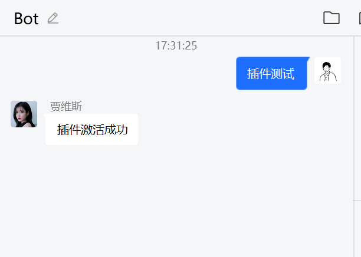

# 插件相关

## 相关仓库

[BotPlugin](https://github.com/BoyChai/BotPlugin)

## 编写插件

```go
package main

import (
	"github.com/BoyChai/BotPlugin"
	"github.com/BoyChai/CoralBot"
)

func main() {
	e := BotPlugin.GetEvent()
	h := BotPlugin.GetHandler()
	//设置插件信息
	BotPlugin.SetInfo(CoralBot.PluginInfo{
		Name:      "demo",
		Summary:   "测试插件demo",
		Version:   "v0.0.1",
		Developer: "BoyChai",
		Email:     "1972567225@qq.com",
	})
    // 创建触发器，这里的触发器需要添加一个RunName参数
	BotPlugin.NewTask(CoralBot.Task{
		Condition: []CoralBot.Condition{
			{
				Key:   &e.Message,
				Value: "插件测试",
			},
		},
		RunName: "demo",
	})
	
    // 将触发之后的命令添加到命令执行器中，这里的第一个值需要和上面的RunName值一样
	BotPlugin.NewHandles("demo", func(event *CoralBot.Event) error {
		_, err := h.Reply(*e, CoralBot.Msg{Message: "插件激活成功"})
		if err != nil {
			return err
		}
		return nil
	})
    // 构建
	BotPlugin.BuildPlugin()
}
```

编写需注意：

- 编译之后后缀需要改为coral
- 编译好的文件名称可以随意


## 使用插件

把编译好的插件放入"./plugin"文件夹,之后代码如下

```go
package main

import (
	"github.com/BoyChai/CoralBot"
)

func main() {
	var e CoralBot.Event
	CoralBot.RunCoralBot(":8080", &e)
}
```

并在"./plugin"文件夹里创建config.yaml文件，写入以下内容

```yaml
handler:
  - name: "all"
    host: "192.168.1.1:5700"
    agreement: "http"
  - name: "demo"
    host: "127.0.0.1:5700"
    agreement: "http"
```

config.yaml格式为:

```yaml
handler:
  - name: ""
    host: ""
    agreement: ""
```

其中name要和插件名称一样(BotPlugin.SetInfo的name)，host是cqhttp的地址，agreement为http。名字如果是all的话就代表全部的插件都可以使用这个配置，如果插件配置存在并且all的配置也存在那么优先使用插件名字的配置。

## 运行插件

运行之后会进行加载插件,并输出插件信息

```bash
2022/12/07 14:10:16 tcp
===============已加载插件===============
插件名称： demo
插件版本： v0.0.1
插件概述： 测试插件demo
插件作者： BoyChai
作者邮箱： 1972567225@qq.com
```

运行之后执行，发送消息"插件测试"即可，效果如下：

