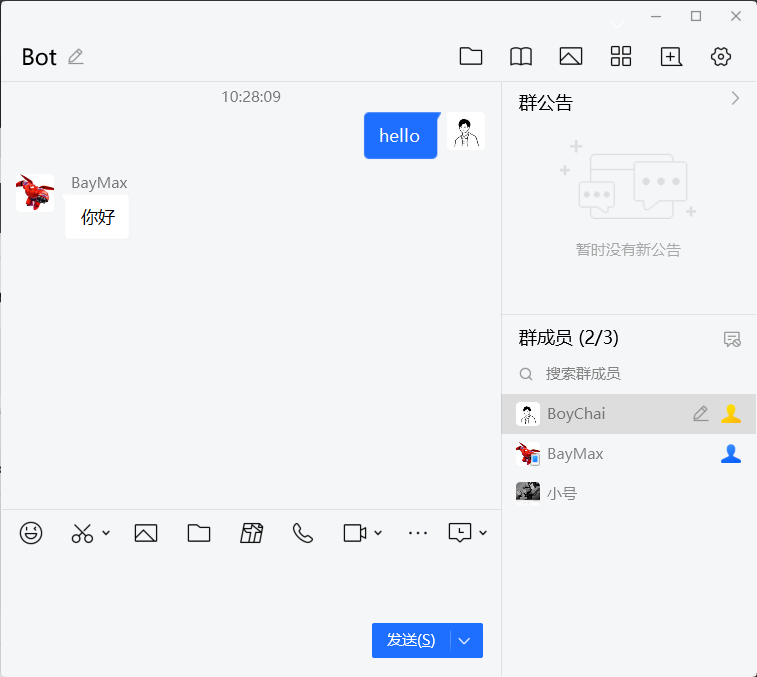

# 兼容性

- [动作](/hanlder)
- [事件](/Event)

# 快速开始

### 要求

- go-cqhttp

- golang语言

### 安装

```
$ go get -u github.com/BoyChai/CoralBot
```

### 使用

使用之前需开启go-cqhttp并且指定http事件主机为本程序主机和端口，之后，创建一个名为`example.go`：

```
$ touch example.go
```

接下来，将以下代码放入`example.go`：

```
package main

import (
	coral "github.com/BoyChai/CoralBot"
)

func main() {
	var e coral.Event
	h := coral.Handle{
		Host:      "127.0.0.1:5700",
		Agreement: "http",
	}
	c1 := []coral.Condition{{
		Key:   &e.Message,
		Value: "hello",
		Regex: true,
	}, {
		Key:   &e.GroupID,
		Value: "<你的QQ群号>",
	}}
	coral.NewTask(coral.Task{
		Condition: c1,
		Run: func() {
			h.SendMsg(coral.Msg{
				GroupId: e.GroupID,
				Message: "你好",
			})
		},
	})
	coral.RunCoralBot(":8080", &e)
}

```

您可以通过以下方式运行代码`go run example.go`，运行之后可以在群聊里面发送hello即可收到回复。效果如下：



